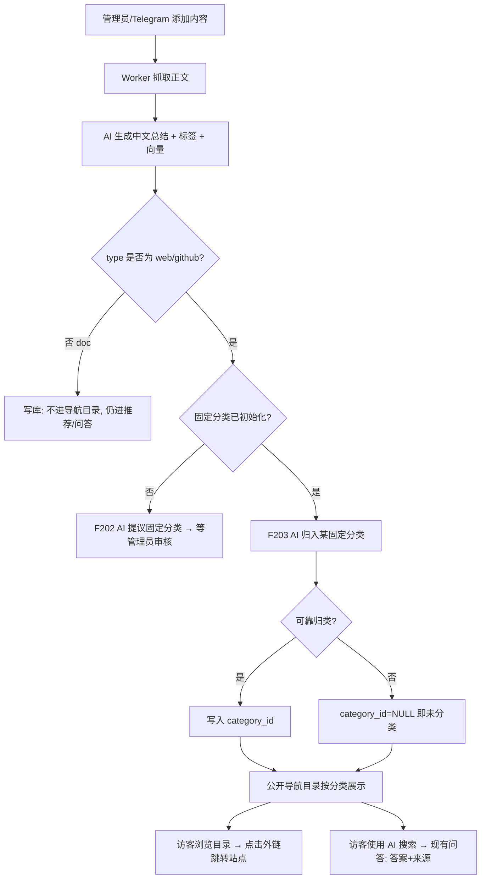
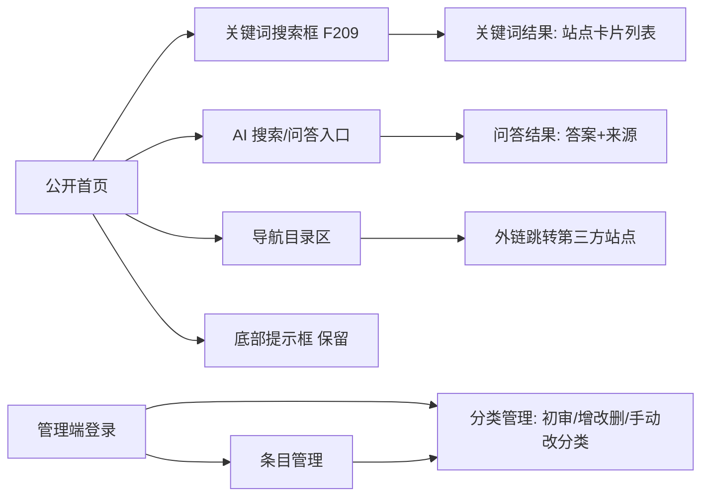
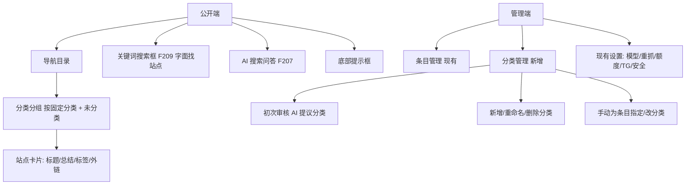

# 收藏系统 · 导航站增强 PRD

## 文档信息
- 文档状态：已确认（用户 2026-08-10 原文「确认需求」）
- 版本：v0.5（增量特性，基于已交付的「收藏系统」；v0.2 追加 F209 关键词模糊搜索；v0.3 F202 升级为可反复手动触发；v0.4 移除 hero 与推荐栏、UI 方向 C；v0.5 关键词框改为「导航目录」标题行右侧紧凑搜索框、取消顶部整块搜索区）
- 目标发布范围：导航站增强里程碑（F2xx 系列）
- 最后更新时间：2026-08-10
- 需求确认依据：用户对接连 7 个关键问题的原文选择（B / C+单主分类 / B搜索 / A内容类型 / 未分类+可维护 / 未分类公开 / 全量公开）；F209 依据用户追加原文「增加模糊关键词搜索框」+ 选择 B（后端关键词模糊）+ A（范围=导航目录内容）+ 与 AI 问答并存。
- 基础代码事实：`src/db/schema.ts`（items 表 type in web|doc|github，含 summary/tags/embedding，无分类字段）；公开端现为「问答优先 + 每日 3 条轮换」；`src/worker/jobs/processItem.ts` 生成总结/标签/向量。

## 0. 范围定义

### 0.1 范围与优先级
本期在**不破坏现有能力**的前提下，为公开端新增「导航目录」，并为内容增加「AI 自动分类」。

- **Must**
  - F201 分类数据模型（新增分类表 + 条目主分类字段，一条内容归一个主分类）
  - F202 分类体系生成与再生成（AI 提议固定分类 → 管理员审核确认；**可反复手动触发**：F202a 补充建议 / F202b 全量重拟，均预览→应用）
  - F203 新增内容自动归类（AI 将新条目归入固定分类之一；归不进 → 「未分类」）
  - F204 分类管理（管理员长期新增/重命名/删除分类、手动改条目分类）
  - F205 公开导航目录（按分类分组，全量展示所有 web+github 条目，含「未分类」公开分组）
  - F206 公开首页布局（主体导航目录；关键词找站点框为紧凑搜索框右对齐于「导航目录」标题行；底部 AI 问答框；**不含** hero、推荐栏与顶部整块搜索区——见 v0.4/v0.5 修订）
  - F209 关键词模糊搜索（后端对导航目录条目的标题/总结/标签做字面模糊匹配，返回匹配站点列表；与 AI 问答框并存）
- **Should**
  - F207 AI 搜索入口在导航站页面复用现有问答（答案 + 来源），行为不变
- **Could**
  - F208 导航目录**分类锚点跳转**（顶部/侧边分类导航条，点击滚动定位到对应分类区块）。

### 0.2 非目标
- 不改变 AI 搜索（F207 问答式）的行为（不把 AI 问答改成「返回站点卡片列表」）；关键词字面检索由独立的 F209 承担。
- F209 不做语义/向量检索，只做字面关键词模糊匹配；不生成 AI 答案。
- 不把纯文本 / PDF（type=doc）纳入导航目录。
- 不移除或弱化现有问答、管理端、限流、加密、Telegram 等既有能力。（v0.4 例外：公开首页的 hero 与「每日3条轮换」推荐栏按用户决定移除展示；M1 后端每日轮换逻辑不主动拆除。）
- 不做多分类/多标签的目录（标签体系保持现状，导航目录仅按单一主分类分组）。
- 不做用户注册/多用户（仍为单管理员模型）。

## 1. 方案概述

### 1.1 核心业务流程图

说明：doc 类内容照常处理但不进导航目录；web/github 类在固定分类就绪后自动归类，归不进落「未分类」，「未分类」公开可见。

### 1.2 核心功能流程图

关键导航规则：导航目录卡片点击 → 新标签打开外链；AI 搜索沿用现有 /ask 问答结果页；底部提示框保持现有位置与内容。

### 1.3 信息架构图

分类原则：导航目录仅组织 web+github 条目；分类为单层扁平结构；「未分类」为系统兜底分组。

### 1.4 角色与权限概览
- 访客（公开、匿名）：浏览导航目录全部 web+github 条目、点击外链、使用 AI 搜索问答、查看推荐栏与底部提示框。受现有公开限流约束。
- 管理员（登录）：初审并确定固定分类、增改删分类、手动为条目指定/修改主分类，以及全部现有管理能力。

## 2. 细节方案

### 2.1 F201 分类数据模型
- 功能编号与优先级：F201，Must
- 功能说明：新增分类实体，并为 items 增加「主分类」外键；一条内容至多一个主分类，可为空（NULL=未分类）。
- 使用角色：系统/管理员
- 前置条件：数据库可执行迁移
- 主流程：新增 `categories` 表（id、name 唯一、slug、sort、created_at）；items 增加 `category_id`（可空，外键，删除分类时置空）。
- 业务规则：name 全局唯一；「未分类」以 category_id IS NULL 表达，不作为一条实体记录；单主分类（非多对多）。
- 数据要求：仅存分类名/排序与条目归属，无敏感数据。
- 验收标准：Given 迁移执行成功，When 查询 items，Then 每条至多关联一个分类且可为空；删除某分类后其下条目 category_id 变为 NULL 且归入「未分类」。

### 2.2 F202 分类体系生成与再生成（AI 提议 + 管理员审核，可反复手动触发）
- 功能编号与优先级：F202，Must
- 功能说明：AI 基于当前收藏库内容提议固定分类，管理员审核后确认为正式分类。**该操作可由管理员反复手动触发**（样本随库增长，重新生成得到更精确的类目）。提供两种动作：
  - **F202a 补充建议（增量）**：AI 只**建议新增**遗漏的分类，**不改动**现有分类名/结构 → churn 最小，适合库变大后补类。
  - **F202b 全量重拟**：AI 基于全库**重新拟一套**分类，可**建议改名/合并/删除**现有类；管理员审核 **diff** 后再应用 → 更精确但改动较大。
- 使用角色：管理员
- 前置条件：库中已有若干 web/github 条目（无则允许管理员手动创建初始分类）
- 入口与触发方式：管理端「分类管理」页；首次为初始化，之后可随时点击「补充建议」或「全量重拟」。
- 主流程：管理员触发某动作 → AI 读取现有条目总结/标签 → 返回**建议（新增/改名/合并/删除）**清单 → 管理员在**预览界面**逐项接受/忽略/编辑 → 「应用」→ 写入 categories。
- 备选与异常流程：
  - **预览再应用，绝不直接覆盖**；管理员可全部忽略。
  - AI 调用失败给出错误且不影响手动增删改（F204）。
  - 应用会改变类目时（改名/合并/删除），**保护人工分类**：`category_manual=true` 的条目不被改动（对齐 Q3）；被合并/删除类下的条目按管理员选择转「未分类」或合并目标。
  - 应用后可选「**对自动归类的存量条目按新类目重跑归类**」（仅动 `category_manual=false` 的条目，复用 F203 逻辑）。
- 页面与状态要求：加载/成功/失败/空（无候选）状态；diff 预览的接受/忽略/编辑状态；重新归类的进度/结果反馈。
- 业务规则：首次确认后进入「已初始化」状态，此后新增内容走 F203 自动归类；再生成不改变「已初始化」事实，只调整类目集合。
- 数据要求：AI 建议为临时数据，应用后才落库；记录本次是 F202a/F202b 及应用了哪些变更（用于追溯）。
- 外部依赖：现有 AI 模型配置（OpenAI 兼容）。
- 数据统计/埋点：重新生成触发次数、每次接受/忽略的建议数、重新归类条目数。
- 验收标准：
  - Given 未初始化，When 管理员触发 AI 提议并确认，Then categories 落库且系统标记已初始化。
  - Given 已有分类，When 触发「补充建议」，Then 只出现新增类候选、现有类名不被改动，管理员接受后仅新增落库。
  - Given 已有分类与已分类条目，When 触发「全量重拟」并在预览中应用了某些改名/合并，Then 现有 `category_manual=true` 条目分类保持不变，被合并/删除类下的自动条目按所选规则转移，前台目录相应更新。
  - Given AI 失败，When 触发，Then 显示错误且不影响手动增删改与既有类目。

### 2.3 F203 新增内容自动归类
- 功能编号与优先级：F203，Must
- 功能说明：固定分类就绪后，Worker 处理每条新 web/github 内容时，由 AI 归入最匹配的一个固定分类；无法可靠归类则置为「未分类」（NULL）。
- 使用角色：系统
- 前置条件：F202 已初始化；条目 type ∈ {web, github}
- 入口与触发方式：`processItem` 处理流程内，在生成总结/标签后执行归类。
- 主流程：读取固定分类清单 → AI 在「现有分类 + 未分类」中择一 → 写 category_id。
- 备选与异常流程：AI 归类失败/低置信 → category_id=NULL；doc 类跳过归类。
- 业务规则：只能归入已存在的固定分类之一，AI 不得新建分类；归类不阻断条目完成（失败不置 items.status=failed，仅落未分类）。
- 数据要求：写 category_id。
- 外部依赖：现有 AI 模型。
- 数据统计/埋点：记录自动归类命中/落未分类次数（用于评估分类质量）。
- 验收标准：Given 已初始化，When 新增一条 web 内容且 AI 能匹配，Then category_id 指向某固定分类；When 无法匹配，Then category_id 为 NULL 且条目仍正常完成并公开于「未分类」。

### 2.4 F204 分类管理
- 功能编号与优先级：F204，Must
- 功能说明：管理员可长期新增、重命名、删除分类，并手动为任意条目指定/修改主分类。
- 使用角色：管理员
- 入口与触发方式：管理端「分类管理」页；条目管理/详情页的分类选择器。
- 主流程：新增/改名/删除分类；在条目上选择分类保存。
- 备选与异常流程：删除仍有条目的分类 → 其下条目转「未分类」（需二次确认）；重名校验拒绝。
- 业务规则：name 唯一；**手动指定的分类优先级高于 AI**——条目一旦被人工设定分类，后续重抓/重处理时保留人工分类，AI 不再覆盖（以 `category_manual` 标记区分人工/自动）。
- 权限与安全：仅登录管理员，沿用现有 CSRF/鉴权。
- 验收标准：Given 登录管理员，When 重命名分类，Then 前台目录分组名同步更新；When 删除分类，Then 其下条目落「未分类」；When 手动改某条目分类，Then 前台该条目移动到目标分组。

### 2.5 F205 公开导航目录
- 功能编号与优先级：F205，Must
- 功能说明：公开端按固定分类分组，全量展示所有 web+github 条目为站点卡片，含「未分类」公开分组。
- 使用角色：访客
- 前置条件：存在 completed 状态的 web/github 条目
- 入口与触发方式：公开首页导航目录区
- 主流程：按分类分组渲染 → 每组内站点卡片**按名称排序** → 每张卡片展示 **favicon 图标 + 标题 + AI 总结 + 标签 + 外链** → 点击卡片新标签打开外链。
- 备选与异常流程：空库显示空状态；**空分类仍显示分组标题**（组内提示无内容）。
- 页面与状态要求：默认/加载/空状态；外链带安全属性 `target=_blank rel="noopener nofollow"`。
- 业务规则：全量公开（不受每日 3 条额度限制）；仅展示 status=completed 的 web/github 条目；组内按名称（标题）排序；分类分组按分类 sort/名称排序，「未分类」固定排在末尾。
- 权限与安全：受现有公开端限流约束；只暴露已收录的公开条目元数据。
- 数据统计/埋点：卡片曝光/点击（口径待确认）。
- 验收标准：Given 库中有 N 条 completed 的 web/github 条目，When 访客打开首页，Then 目录按分类分组展示全部 N 条，未归类的出现在「未分类」组；点击卡片在新标签打开对应外链。

### 2.6 F206 公开首页布局（v0.4 修订）
- 功能编号与优先级：F206，Must
- 功能说明：公开导航站首页为「**导航目录（F205）为主体** + **关键词找站点框（F209）作为紧凑搜索框右对齐显示在"导航目录"标题行**（即原"原型演示数据"标签所在的右上角位置，与目录标题平行）+ **底部：AI 问答框（F207，即用户所称"底部提示框"，保持原位）**」。**移除** hero 大标题/宣传语区块与「每日3条轮换」推荐栏，也**不再有顶部整块搜索区**（用户 2026-08-11 决定关键词框改为目录标题行右侧紧凑搜索框）。
- 使用角色：访客
- 主流程：单页从顶部「关键词找站点」框直接进入分类导航目录；AI 问答框保留在底部原位。无 hero、无推荐栏。
- 业务规则：**AI 问答框（底部提示框）位置与行为保持现状**（用户选 A：仅底部保留 AI 问答，顶部只放关键词框，二者不并排）；页面顶部不再展示营销标题与每日轮换。
- 页面与状态要求：各区块加载/空状态；具体版式与响应式交由 UI 设计师，约束「关键词框在顶部、导航目录为主体、AI 问答框保留在底部、无 hero、无推荐栏」。
- 变更说明：v0.1–v0.3 曾要求保留推荐栏（每日3条轮换）与 hero；v0.4 用户明确要删除截图所示两块内容（hero + 今日轮换推荐栏），推翻早期「保留推荐」决定。M1 后端每日轮换（dailySelections）逻辑本次不主动拆除，仅公开端不再展示；如需彻底移除后端功能，另行确认。
- 显示文案（v0.6，用户 2026-08-11）：公开首页目录区**移除** eyebrow「ALL SAVES · WEB + GITHUB」、副标题「固定分类 · 组内按名称排序 · N 条…」、关键词框旁说明文字「关键词找站点 / 字面匹配…不使用 AI」（**保留**搜索输入框与按钮）；目录标题由「导航目录」**改为「目录」**（"导航目录/F205"仍为内部功能名，仅显示文案变更）。
- 验收标准：Given 打开公开首页，When 页面加载完成，Then 顶部为关键词搜索框与 AI 问答入口、主体为分类导航目录、底部保留提示框；页面**不出现** hero 标题区与「今日轮换」推荐栏。

### 2.7 F207 AI 搜索（复用现有问答）
- 功能编号与优先级：F207，Should
- 功能说明：导航站页面提供 AI 搜索入口，行为与现有语义问答完全一致（返回中文答案 + Top 来源，无命中不编造）。
- 使用角色：访客
- 入口与触发方式：首页搜索框 → 现有 /ask 链路
- 业务规则：不改变现有问答检索阈值、限流与不编造策略。
- 外部依赖：现有 ask 链路与向量检索。
- 验收标准：Given 访客在首页输入问题，When 提交，Then 得到与现有问答一致的答案与来源；无命中时不调用归纳模型。

### 2.8 F209 关键词模糊搜索
- 功能编号与优先级：F209，Must
- 功能说明：导航站页面提供一个独立的关键词搜索框，后端对**导航目录范围内**的条目做**字面模糊匹配**，返回匹配站点列表；与 F207 AI 问答框**并存、各自独立**（一个字面找站点、一个 AI 问答，互不替代）。
- 使用角色：访客
- 前置条件：存在 completed 状态的 web/github 条目
- 入口与触发方式：公开首页「导航目录」标题行右侧的**紧凑搜索框**（右对齐，与目录标题平行，位于原"原型演示数据"标签位置；独立于底部 AI 问答框）
- 主流程：输入关键词 → 提交（或输入防抖）→ 后端对 **web+github 且 status=completed** 条目的**标题 / AI 总结 / 标签**做**不区分大小写的模糊匹配** → 返回匹配站点卡片列表（复用导航卡片样式：favicon+标题+总结+标签+外链）。
- 备选与异常流程：空关键词恢复常规目录视图；无命中显示「无匹配」空状态且**不调用 AI**；输入过短（如 <1 字符）不触发。
- 页面与状态要求：默认/输入中/加载/结果/空结果状态；结果区与常规目录的切换关系（覆盖目录 or 就地过滤展示）交由 UI 设计师，仅约束「返回站点列表、与 AI 问答框并存」。
- 业务规则：**范围仅限导航目录内容（web+github，completed）**，不含 doc；**仅字面模糊匹配，不做语义/向量检索**；受现有公开端限流约束；只暴露公开条目元数据。
- 数据要求：只读查询 items 的 title/summary/tags；无写入。
- 权限与安全：匿名可用；沿用公开限流；对关键词做长度/字符边界校验，参数化查询防注入。
- 数据统计/埋点：关键词搜索次数、命中率（口径待细化）。
- 验收标准：Given 目录内存在标题/总结/标签包含「向量」的站点，When 访客在关键词框输入「向量」，Then 返回全部字面命中的站点卡片列表且不生成 AI 答案；When 无命中，Then 显示无匹配空状态且不调用 AI；When 清空关键词，Then 恢复常规分类目录视图。
- 待细化（实施/UI 阶段，不阻塞需求）：是否中文分词 vs 简单子串匹配、匹配字段权重与排序、结果区呈现方式、输入防抖时延。

### 2.N 非功能性需求
- 性能：导航目录首屏在数百条内容规模下应可正常渲染（现有系统面向单机 VPS/数百条设计）；具体首屏时间指标待确认。
- 可靠性：自动归类失败不得阻断条目完成，退化为「未分类」。
- 兼容性：沿用现有运行环境（Node 20、PostgreSQL 16 + pgvector）；前端目标浏览器范围待确认（不默认写入具体浏览器）。
- 安全与隐私：导航目录只暴露已收录公开条目元数据；沿用现有加密、限流、脱敏、鉴权。
- 可访问性：沿用现有标准；导航目录键盘可达与对比度要求待 UI 阶段量化。
- 可观测性：新增自动归类命中率/未分类率日志（脱敏）。
- 国际化：新界面沿用现有中英文双语框架（next-intl），AI 总结/回答保持中文。

## 3. 依赖、约束与风险
- 依赖：现有 AI 模型配置、pgvector、pg-boss worker、既有问答链路。
- 约束：单管理员模型；单层扁平分类；单主分类。
- 风险：
  - R1 AI 自动归类准确率不稳定 → 缓解：低置信落「未分类」+ 管理员手动纠正 + 归类质量埋点。
  - R2 全量公开改变了原有「限量曝光」隐私策略 → 已由用户确认接受（全量公开）。
  - R3 手动分类与后续自动归类的覆盖冲突 → 见待确认 Q3。

## 4. 待确认问题（已全部确认）
- Q1 组内排序：**按名称**。已确认。
- Q2 空分类：**仍显示分组标题**。已确认。
- Q3 手动 vs 自动分类优先级：**保留人工分类，AI 不覆盖**。已确认。
- Q4 推荐栏：~~保持现有每日 3 条轮换~~ → **v0.4 推翻：移除公开首页推荐栏（连同 hero 标题区）**。已确认（用户 2026-08-10 选 C：两块都删）。
- Q5 外链 **加 nofollow**；卡片 **显示 favicon 图标**。已确认。
- Q6 F208：**只做分类锚点跳转**。已确认。（注：此前「不做站内关键词筛选」的判断已被 v0.2 修订——用户于 UI 选型阶段追加 F209 后端关键词模糊搜索，与 AI 问答并存；F208 的锚点跳转与 F209 的关键词搜索是不同功能，均保留。）
- Q7 F209 关键词搜索：**后端字面模糊匹配 / 范围=导航目录内容(web+github) / 与 AI 问答并存**。已确认。
- Q8 F202 再生成：**可反复手动触发，两种动作都要（F202a 补充建议 + F202b 全量重拟），均预览→应用，保护人工分类，可选重跑自动条目**。已确认。
- 决定：**UI 方向 = C 工作台**（用户 2026-08-10 定；先前曾选 B 今日流，后改 C）。

剩余非阻塞细节（交由 UI/实施阶段量化，不影响需求确认）：导航目录首屏性能量化指标、目标浏览器范围、目录键盘可达/对比度的具体数值、埋点字段口径。

## 5. 验收与追踪
- F201→迁移与 schema 测试；F202→分类初始化 + 补充建议(增量) + 全量重拟(diff 预览/应用/保护人工分类/可选重跑) e2e；F203→worker 归类单测 + 未分类兜底；F204→管理端分类 CRUD 与手动改分类 e2e；F205→公开目录全量展示 e2e；F206→首页各区块并存 e2e；F207→问答回归测试；F209→关键词模糊搜索命中/空结果/清空恢复 e2e + 后端查询单测（范围限 web+github completed、字面匹配、不调用 AI、参数化防注入）。
- 追踪关系在进入 UI 与实施计划阶段补全到任务与用例编号。
