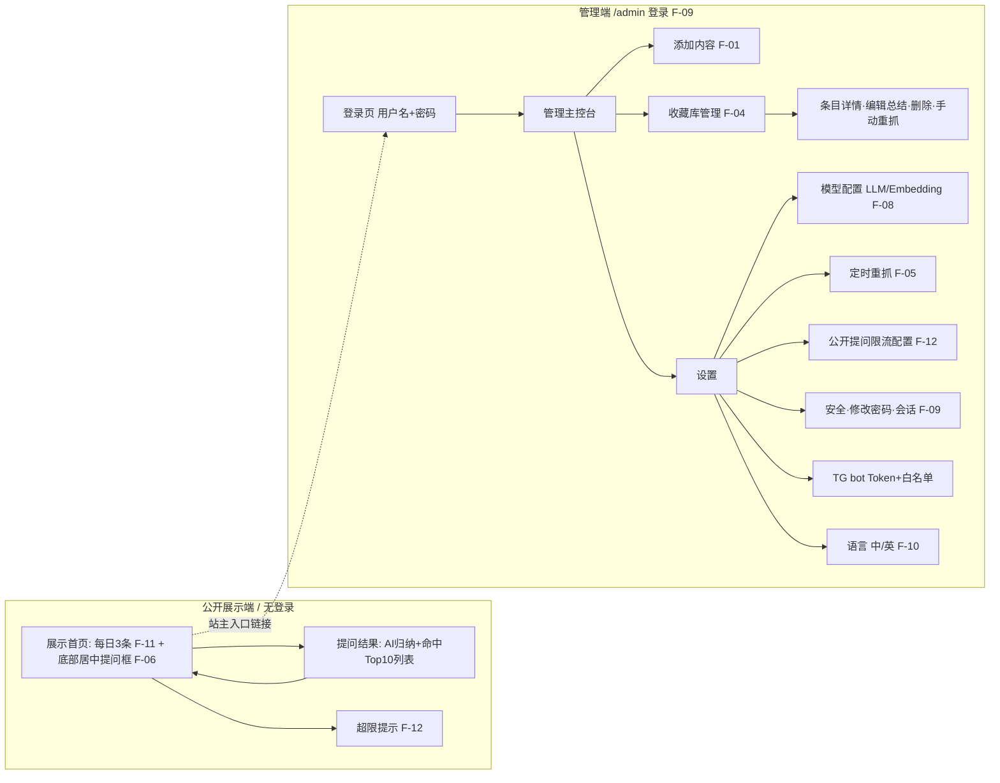
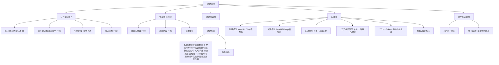

# 收藏系统 PRD

## 文档信息
- 文档状态：待重新确认（修订版：公开展示端 + 登录管理端；管理端仅用户名+密码登录，不启用 2FA）
- 版本：v0.4（需求修订草稿）
- 目标发布范围：v1（首个可用版本）
- 最后更新时间：2026-08-08
- 需求确认依据：与用户的逐轮需求访谈原文（含本轮拆分决策："前端公开只读""每日随机 3 条轮换""同一 Next.js 两个区域""不做登录、公开提问加次数限制""本来就打算公开给别人使用的同时自己也可以用"）

## 0. 范围定义

### 0.1 范围与优先级
第一期（v1）目标：单管理员、自部署在公网 VPS 的内容收藏系统，对外公开展示 + 公开问答，站主私有管理。

技术形态（已定稿，见 decisions.md D-01）：**Next.js 全栈一体化 + 后台 worker 进程**；同一应用两个区域——`/` 公开展示端、`/admin` 登录管理端；数据库 PostgreSQL + pgvector。

- **Must（v1 必做）**
  - F-01 管理端 · 添加内容
  - F-02 Telegram bot · 添加内容
  - F-03 抓取与 AI 总结管线（异步、去重、自动标签、失败自动重试 + 手动重试）
  - F-04 管理端 · 收藏库管理（全量浏览/筛选/详情/编辑总结/删除/手动重抓）
  - F-05 定时自动重新抓取（全局周期）
  - F-06 公开展示端 · 提问检索（**无登录、公开**，AI 归纳 + 命中列表，底部居中提问框，带限流）
  - F-07 Telegram bot · 提问检索（白名单私有）
  - F-08 模型配置（对话模型与嵌入模型分别配置，OpenAI 兼容）
  - F-09 管理端认证与安全（仅保护 `/admin`：用户名 + 密码 + 登录失败限流 + 会话；不启用 2FA）
  - F-10 国际化（界面中 / 英切换，默认中文；覆盖展示端与管理端）
  - F-11 公开展示端 · 每日随机 3 条轮换展示
  - F-12 公开提问限流与防滥用（单 IP + 全站每日总量，管理端可配置）

### 0.2 非目标（v1 明确不做）
- 飞书 bot 入口（后续迭代）。
- Agent 接入（MCP Server / 开放 API，供外部 AI 助手调用"添加内容"）（后续迭代）。
- 多用户账号体系 / 访客注册（仅一个站主管理员账号；公开访客匿名只读+提问）。
- 抓取需要登录 / 付费墙 / 私有 GitHub 仓库的内容（不做凭证/Token 管理）。
- 公开展示端的全量浏览（公开端只展示每日 3 条 + 提问；全量浏览在管理端）。
- 移动端原生 App（v1 为响应式网页 + TG bot）。

### 0.3 关键取舍与已记录风险（用户已明确接受）
- 公开展示端无登录，且公开提问会返回**全库命中内容 + 链接**，等于**收藏库内容可通过公开问答对外可见**。用户明确接受（意图即"公开给别人使用的同时自己也可以用"）。限流仅控制次数与费用，不改变内容可被查询这一事实。

## 1. 方案概述

### 1.1 核心业务流程图
用户完成核心目标的端到端业务逻辑：①站主收藏内容，②访客/站主检索提问，③公开展示。

```mermaid
flowchart TD
    subgraph 收藏[站主收藏内容 端到端]
      A[站主得到一个链接] --> B{添加入口}
      B -->|管理端 F-01| C[粘贴链接并提交]
      B -->|Telegram F-02| D[发送链接给 bot 白名单校验]
      C --> E[链接校验 + 去重 F-03]
      D --> E
      E -->|已存在| F[提示已收藏 可选重新抓取更新]
      E -->|新链接| G[入库 标记 处理中]
      G --> H[异步抓取 F-03]
      H -->|失败| I[自动重试最多3次]
      I -->|仍失败| J[标记失败+原因+可手动重试]
      H -->|成功| K[LLM 生成一段话总结+3-5标签]
      K --> L[生成向量嵌入入库]
      L --> M[标记完成 · 管理端更新 · TG 主动回执]
    end
    subgraph 检索[提问检索 端到端]
      N[提出自然语言问题] --> O{入口}
      O -->|公开展示端 F-06 无登录 先过限流 F-12| P[语义检索 仅库内完成条目]
      O -->|Telegram F-07 白名单| P
      P -->|有命中| Q[LLM 基于命中内容归纳 + 附来源列表 Top10]
      P -->|无命中| R[明确答 收藏库中没有相关内容 不编造]
      O -->|公开端超出限流| S[提示今日提问已达上限 不调用模型]
    end
    subgraph 展示[公开展示 F-11]
      T[访客打开公开展示端] --> U[展示当日随机挑选的3条 去重轮换]
      U --> V[底部居中提问框 触发 F-06]
    end
```

### 1.2 核心功能流程图
两个区域（公开展示端 `/` 与登录管理端 `/admin`）的页面进入、跳转与返回关系。

关键导航规则：公开端任何人可访问，仅展示 3 条 + 提问；管理端全部页面需登录（用户名+密码）；两端同属一个 Next.js 应用，`/` 为公开区、`/admin` 为受保护区。

### 1.3 信息架构图

分类原则：先按"公开端 / 管理端"两大访问面组织，再按"内容—配置—账户安全"划分数据与能力；收藏条目为核心对象，新增"最近展示日期"字段支撑每日轮换去重。

### 1.4 角色与权限概览
| 角色 | 可访问范围 | 关键操作 | 数据边界 |
| --- | --- | --- | --- |
| 站主（唯一管理员） | 管理端 `/admin`（用户名+密码登录）+ 公开端 | 添加/管理/删除内容、全部配置、看全量库 | 系统单管理员；管理全库 |
| 公开访客（匿名，无登录） | 公开端 `/` | 浏览每日 3 条、提问检索（受限流） | 只能被动看 3 条；主动提问可命中全库（用户已接受） |
| Telegram 白名单用户（=站主本人） | TG bot | 添加内容、提问检索 | 与库同源；仅白名单响应 |
| 非白名单 TG 用户 / 其他 | 无 | 无 | bot 不响应，无数据访问 |

## 2. 细节方案

### 2.1 F-01 管理端 · 添加内容
- 功能编号与优先级：F-01，Must
- 功能说明：站主在管理端粘贴链接（网站/文档/GitHub 公开仓库）提交，触发收藏管线。
- 使用角色：站主（已登录 `/admin`）
- 前置条件：已登录管理端；对话模型与嵌入模型均已配置（未配置则阻断并引导，见 F-08）。
- 入口与触发方式：管理端"添加内容"页输入框，点击"添加"。
- 主流程：输入链接 → 前端格式校验 → 提交 → 去重检测（F-03）→ 新链接入库"处理中" → 返回"已加入，正在抓取总结中"。
- 备选与异常流程：格式非法→即时报错不入库；已存在→提示"该链接已收藏"，提供"重新抓取更新"；模型未配置→阻断并引导设置。
- 页面与状态要求：输入默认态、提交中（禁用）、成功、失败、重复提示。
- 业务规则：链接标准化后用于去重（幂等）；来源渠道=admin。
- 数据要求：输入=URL；输出=新建/命中条目。敏感等级：低。
- 权限与安全：需登录会话 + CSRF 保护。
- 外部依赖：无（抓取总结在 F-03 异步）。
- 数据统计/埋点：记录添加事件（渠道=admin、是否命中去重）。
- 验收标准：
  - Given 已登录且模型已配置，When 提交新链接，Then 立即出现"处理中"条目并提示已加入。
  - Given 提交已存在链接，When 提交，Then 提示"已收藏"并提供"重新抓取更新"，不新建重复条目。
  - Given 未登录访问添加接口，When 请求，Then 被拒绝（重定向登录/401）。

### 2.2 F-02 Telegram bot · 添加内容
- 功能编号与优先级：F-02，Must
- 功能说明：白名单用户在 TG 发链接给 bot 即收藏。
- 使用角色：白名单 Telegram 用户（=站主）
- 前置条件：bot 已配置 Token 且发送者在用户 ID 白名单；模型已配置。
- 入口与触发方式：向 bot 发送含链接的消息。
- 主流程：收消息 → 校验白名单 → 解析链接 → 去重 → 入库"处理中" → 立即回"处理中" → 完成后主动回"✅ 已收藏 + 一句话总结"。
- 备选与异常流程：非白名单→不响应；无合法链接→回提示；已存在→回"已收藏"，可指令重抓；失败→回失败提示（含手动重试指令）。
- 页面与状态要求：不适用（对话式，以回执体现状态）。
- 业务规则：与 F-01 共用去重与管线；来源渠道=telegram；多链接默认逐条处理。
- 数据要求：输入=URL + 发送者 ID；敏感等级：低。
- 权限与安全：严格用户 ID 白名单；bot Token 为敏感配置，不回显明文。
- 外部依赖：Telegram Bot API（webhook 或 long polling）。
- 数据统计/埋点：记录添加事件（渠道=telegram）。
- 验收标准：
  - Given 白名单用户发新链接，When bot 收到，Then 立即回"处理中"，完成后主动回一句话总结。
  - Given 非白名单用户发消息，When bot 收到，Then 不泄露任何库内信息（不响应/忽略）。
  - Given 发送已存在链接，When bot 收到，Then 回"已收藏"，不新建重复条目。

### 2.3 F-03 抓取与 AI 总结管线（异步）
- 功能编号与优先级：F-03，Must
- 功能说明：对新增/重抓链接异步抓取，LLM 生成中文一段话总结 + 3–5 标签，并生成向量嵌入入库。运行于后台 worker 进程。
- 使用角色：系统（后台任务）
- 前置条件：条目已入库"处理中"；对话与嵌入模型已配置可用。
- 入口与触发方式：F-01/F-02 新增、F-04 手动重抓、F-05 定时重抓触发。
- 主流程：取任务 → 抓取（网页/文档正文提取；GitHub 抓 README + 元信息：描述、topics、主要语言、star 数）→ LLM 生成一段话总结（中文，约 2–4 句）+ 标签（3–5）→ 生成向量嵌入 → 更新"完成"。
- 备选与异常流程：抓取/总结失败→自动重试最多 3 次（退避）；仍失败→标记"失败"+记录原因，支持手动重试（管理端 / TG 指令）；重抓且内容未变（内容指纹一致）→不更新；人工编辑过的总结默认不被自动覆盖。
- 页面与状态要求：状态在"处理中/完成/失败"流转；失败态展示原因与重试入口（管理端）。
- 业务规则：总结/标签严格基于该条抓取内容；类型识别决定抓取策略；幂等。
- 数据要求：输出=标题、总结、标签、向量、内容指纹、状态、失败原因。存 PostgreSQL（含向量列）。敏感等级：低。
- 权限与安全：仅抓公开内容；抓取设超时/大小上限；基本 SSRF 防护（禁止内网地址）。
- 外部依赖：目标站点/GitHub、对话模型 API、嵌入模型 API。
- 数据统计/埋点：处理耗时、成功/失败、重试次数。
- 验收标准：
  - Given 可访问公开网页，When 处理完成，Then 条目含非空中文总结 + 3–5 标签，状态=完成。
  - Given 抓取连续失败，When 重试 3 次仍失败，Then 状态=失败并记录原因，提供手动重试。
  - Given 对同一条目重抓且内容未变，When 完成，Then 不改写原总结/标签。
  - Given GitHub 公开仓库，When 完成，Then 总结基于 README + 元信息生成。
- 抓取策略（Q-04 定稿）：v1 采用轻量 HTTP 抓取 + 正文提取，不引入无头浏览器；重 JS/失败页面走失败重试→标记失败→手动重试或手动编辑总结兜底；无头渲染列后续可选增强。

### 2.4 F-04 管理端 · 收藏库管理
- 功能编号与优先级：F-04，Must
- 功能说明：站主在管理端浏览与管理全量收藏库。
- 使用角色：站主（已登录）
- 前置条件：已登录。
- 入口与触发方式：管理主控台 → 收藏库管理页。
- 主流程：查看全量条目列表（标题/链接/总结/标签/状态/来源/时间）→ 按关键词或标签筛选 → 进入详情 → 删除 / 编辑总结 / 手动触发重抓。
- 备选与异常流程：空库→空状态；删除→二次确认，删除后其向量一并移除、不再出现在检索；编辑总结→保存更新并标记"人工编辑"（防被定时重抓覆盖）；手动重抓→置"处理中"走 F-03。
- 页面与状态要求：默认、加载、空、成功、失败、禁用状态需覆盖。
- 业务规则：仅管理端可全量浏览（公开端不提供全量浏览）；人工编辑的总结默认不被自动改写。
- 数据要求：读写条目记录。敏感等级：低。
- 权限与安全：需登录会话 + CSRF。
- 外部依赖：无（重抓复用 F-03）。
- 数据统计/埋点：删除、编辑、手动重抓事件。
- 验收标准：
  - Given 库中有条目，When 按标签筛选，Then 仅显示含该标签条目。
  - Given 删除某条目并确认，When 完成，Then 该条目及向量被移除且不再出现在任何检索结果（含公开端）。
  - Given 编辑总结并保存，When 完成，Then 列表/详情显示新总结且标记人工编辑。
  - Given 点击手动重抓，When 触发，Then 条目转"处理中"并按 F-03 处理。

### 2.5 F-05 定时自动重新抓取
- 功能编号与优先级：F-05，Must
- 功能说明：后台按全局统一周期自动重抓所有条目，内容有变化时更新总结/标签/向量。
- 使用角色：系统（定时任务，后台 worker）；站主配置周期。
- 前置条件：管理端开启定时重抓并设定间隔天数。
- 入口与触发方式：调度器按间隔触发。
- 主流程：到期 → 遍历条目 → 逐条走 F-03 → 内容有变则更新，无变则跳过。
- 备选与异常流程：单条失败按 F-03 处理不影响其余；关闭开关不再触发；人工编辑过的总结默认不被自动覆盖。
- 页面与状态要求：管理端展示开关、间隔天数、上次/下次运行时间。
- 业务规则：全局单周期（非按条/按标签）。
- 数据要求：调度配置（开关、间隔、上次运行时间）。敏感等级：低。
- 权限与安全：仅站主可改。
- 外部依赖：抓取目标、模型 API（复用 F-03）。
- 数据统计/埋点：每轮处理/更新/失败数量。
- 验收标准：
  - Given 开启且间隔 N 天，When 到期，Then 自动执行重抓。
  - Given 某条目内容已变化，When 重抓完成，Then 其总结/标签/向量更新。
  - Given 关闭定时重抓，When 到原周期，Then 不触发。

### 2.6 F-06 公开展示端 · 提问检索（公开）
- 功能编号与优先级：F-06，Must
- 功能说明：**任何访客无需登录**，在公开展示端底部居中的提问框提问，语义检索全库并返回"AI 归纳回答 + 命中 Top10 列表"；受 F-12 限流保护。
- 使用角色：公开访客（匿名）、站主
- 前置条件：嵌入与对话模型已配置；库中有"完成"条目；未超出限流（F-12）。
- 入口与触发方式：公开展示端**底部正中固定提问框**，输入问题提交。
- 主流程：提交问题 → 先过限流校验（F-12）→ 生成查询向量 → 库内语义检索（仅"完成"条目）→ 取相关 Top10 → LLM 基于命中内容归纳回答并附来源列表（标题+链接+总结）。
- 备选与异常流程：无命中→明确回答"收藏库中没有相关内容"，不编造、不引库外知识；超出限流→返回"今日提问已达上限，请稍后再来"，**不调用模型**；模型/检索出错→错误提示与重试。
- 页面与状态要求：默认（底部居中提问框）、检索中、结果（归纳+列表）、无结果、超限、错误状态；结果区展示需适配匿名公开访问。
- 业务规则：检索范围严格限定库内内容；回答只引用命中的库内条目；每条结果附可点击原始链接；公开访问不暴露管理端信息。
- 数据要求：输入=问题文本（+访客 IP 用于限流）；输出=归纳文本 + 命中列表。敏感等级：中（涉及 IP 与费用控制；问题原文留存策略在实施阶段定，默认最小化）。
- 权限与安全：无需登录；必须叠加 F-12 限流与防滥用；对输入做长度限制与基本注入防护（提示词注入缓解在实施阶段处理）。
- 外部依赖：嵌入模型 API（查询向量）、对话模型 API（归纳）。
- 数据统计/埋点：查询事件、命中数、是否无结果、是否被限流（用于质量与费用观测）。
- 验收标准：
  - Given 库中有与"网络安全"语义相关但未含该词的条目，When 匿名访客提问"我想学习网络安全知识"，Then 该条目被语义关联召回并出现在命中列表。
  - Given 库中确无相关内容，When 提问，Then 明确回答"收藏库中没有相关内容"，不虚构条目/链接。
  - Given 有命中，When 返回，Then 归纳回答后附命中列表，每条含可点击原始链接。
  - Given 访客已达限流上限，When 再次提问，Then 返回超限提示且不调用任何模型 API。

### 2.7 F-07 Telegram bot · 提问检索（私有）
- 功能编号与优先级：F-07，Must
- 功能说明：白名单用户在 TG 提问，返回 AI 归纳 + 命中列表。
- 使用角色：白名单 Telegram 用户（=站主）
- 前置条件：发送者在白名单；模型已配置。
- 入口与触发方式：向 bot 发送非链接的自然语言问题（可 URL 判定为添加，否则视为提问，或用命令前缀，实施阶段定）。
- 主流程：同 F-06 的检索与归纳，以消息返回归纳 + 命中条目（标题+链接）。
- 备选与异常流程：无命中→回"收藏库中没有相关内容"；非白名单→不响应。
- 页面与状态要求：不适用（对话式）。
- 业务规则：与 F-06 共用检索/归纳逻辑；受 TG 消息长度限制适配列表条数/格式；**TG 侧不受公开限流 F-12 约束**（白名单私有）。
- 数据要求：输入=问题文本 + 发送者 ID；敏感等级：低。
- 权限与安全：严格白名单。
- 外部依赖：Telegram Bot API、嵌入与对话模型 API。
- 数据统计/埋点：查询事件（渠道=telegram）。
- 验收标准：
  - Given 白名单用户在 TG 提问且库中有相关内容，When 发送，Then 返回 AI 归纳 + 命中条目（含链接）。
  - Given 库中无相关内容，When 提问，Then 回"收藏库中没有相关内容"，不编造。
  - Given 非白名单用户提问，When 发送，Then 不返回任何库内信息。

### 2.8 F-08 模型配置（对话模型 + 嵌入模型）
- 功能编号与优先级：F-08，Must
- 功能说明：在管理端分别配置对话模型（LLM）与嵌入模型（Embedding），以 OpenAI 兼容接口为主。
- 使用角色：站主（已登录）
- 前置条件：已登录。
- 入口与触发方式：管理端设置 → 模型配置。
- 主流程：分别填对话/嵌入模型的 baseURL + API Key + 模型名 → 可测连通性 → 保存。
- 备选与异常流程：连通性测试失败→提示错误；关键功能（添加/检索）在模型未配置时明确阻断并引导。
- 页面与状态要求：两组独立表单；测试中/成功/失败；Key 掩码不回显明文。
- 业务规则：对话模型用于 F-03 总结与 F-06/F-07 归纳；嵌入模型用于向量入库与查询；更换嵌入模型可能需重建向量（提示用户）。
- 数据要求：baseURL、模型名、API Key（敏感，加密存储，不回显）。敏感等级：高。
- 权限与安全：仅站主可查看/修改；Key 加密存储、日志脱敏。
- 外部依赖：用户所配置的第三方/本地模型服务。
- 数据统计/埋点：不采集 Key；可记录"配置更新事件"（不含明文）。
- 验收标准：
  - Given 分别填入合法 LLM 与 Embedding 配置，When 保存，Then 后续添加与检索使用对应模型成功工作。
  - Given 填入错误配置并测试，When 测试，Then 返回明确失败原因且不影响已有可用配置。
  - Given 查看已保存配置，When 打开，Then API Key 掩码显示，不回显明文。

### 2.9 F-09 管理端认证与安全
- 功能编号与优先级：F-09，Must
- 功能说明：仅保护管理端 `/admin`——**用户名 + 密码登录**（不启用 2FA，用户明确要求），含登录失败限流与会话管理。**公开展示端 `/` 不需要登录。**
- 使用角色：站主
- 前置条件：首次部署完成管理员账号初始化。
- 入口与触发方式：访问 `/admin` 任意受保护页面时要求登录；公开端不触发。
- 主流程：输入用户名+密码 → 校验 → 建立会话进入管理端。
- 备选与异常流程：凭证错误→提示并计入限流；多次失败→临时锁定/退避；会话超时→重登。
- 页面与状态要求：登录页、错误提示、锁定提示。
- 业务规则：密码加盐哈希（argon2/bcrypt，实施阶段定）；管理端全程 HTTPS；`/admin` 路由服务端强制鉴权。（2FA 不在 v1 范围，列为后续可选增强。）
- 数据要求：用户名、密码哈希、会话。敏感等级：高。
- 权限与安全：登录限流防爆破；会话超时登出；密码哈希存储；日志脱敏；CSRF 防护；确保公开端不泄露管理端接口/数据。建议强制强密码策略以弥补无 2FA 的风险。
- 外部依赖：无。
- 数据统计/埋点：登录成功/失败次数（安全观测），不记录明文凭证。
- 验收标准：
  - Given 正确用户名+密码，When 登录，Then 进入管理端并建会话。
  - Given 错误密码，When 登录，Then 拒绝进入并计入失败限流。
  - Given 连续多次失败，When 达阈值，Then 触发限流/锁定。
  - Given 未登录访问任一 `/admin` 页面或写接口，When 请求，Then 被拒绝（重定向登录/401/403）。

### 2.10 F-10 国际化（中/英切换）
- 功能编号与优先级：F-10，Must
- 功能说明：公开展示端与管理端界面均支持中/英切换，默认中文。
- 使用角色：站主、公开访客
- 前置条件：无。
- 入口与触发方式：界面语言选择器（两端均可切换）。
- 主流程：选择语言 → 文案切换 → 持久化偏好（访客侧可用本地存储）。
- 备选与异常流程：缺失翻译回退默认语言。
- 页面与状态要求：所有界面文案随语言切换；日期/数字本地化范围实施阶段定。
- 业务规则：语言仅影响界面文案；AI 生成的总结固定中文（见 F-03），不随界面语言变化（英文总结属后续需求）。
- 数据要求：语言偏好。敏感等级：低。
- 验收标准：
  - Given 界面中文，When 切换英文，Then 主要文案变英文并持久化（管理端与公开端均生效）。
  - Given 存在未翻译文案，When 切换，Then 回退默认语言且无空白/报错。

### 2.11 F-11 公开展示端 · 每日随机 3 条轮换展示
- 功能编号与优先级：F-11，Must
- 功能说明：公开展示端首页每日展示**随机挑选的 3 条**已完成收藏，**每日自动更换**，尽量不重复展示相同内容；当库内可展示内容过少、已遍历完毕时才允许重复。
- 使用角色：公开访客、站主
- 前置条件：库中存在"完成"状态条目。
- 入口与触发方式：访客打开公开展示端首页时展示当日的 3 条。
- 主流程：按"当日"选出 3 条 → 优先选择近期未展示过的条目（依据条目"最近展示日期"）→ 展示标题/一段话总结/标签/原始链接。
- 备选与异常流程：可展示条目 < 3 → 展示实际数量；全部条目在本轮都已展示过 → 允许重复（重置轮换）；库为空 → 展示空状态引导（仅站主可去管理端添加）。
- 页面与状态要求：默认（3 条卡片 + 底部提问框）、空库状态、加载状态。
- 业务规则：以"每日"为轮换粒度（同一天多次访问看到同一组 3 条，保证稳定）；用"最近展示日期/展示计数"实现去重轮换；仅展示"完成"条目（不展示处理中/失败）。
- 数据要求：条目新增字段"最近展示日期"（及可选展示计数）。敏感等级：低。
- 权限与安全：公开只读展示；不暴露管理信息。
- 外部依赖：无。
- 数据统计/埋点：可记录展示曝光（可选）。
- 验收标准：
  - Given 库中有 ≥3 条完成条目，When 访客当日打开首页，Then 展示随机 3 条，且同一天内多次访问结果稳定。
  - Given 次日再访问，When 打开首页，Then 展示的 3 条尽量不与近期已展示重复（除非库存不足已遍历）。
  - Given 库中完成条目 <3，When 打开，Then 仅展示实际数量，不报错。

### 2.12 F-12 公开提问限流与防滥用
- 功能编号与优先级：F-12，Must
- 功能说明：对公开展示端提问（F-06）施加可配置的次数限制，控制滥用与站主的模型 API 费用。
- 使用角色：系统（限流）；站主（在管理端配置）
- 前置条件：无。
- 入口与触发方式：每次公开提问在调用模型前先过限流校验。
- 主流程：收到公开提问 → 校验单 IP 时间窗计数与全站每日总量 → 未超限则放行走 F-06、并累加计数 → 超限则拒绝。
- 备选与异常流程：超单 IP 限额或超全站每日总量 → 返回"今日提问已达上限，请稍后再来"，不调用模型；站主可在管理端调整阈值或临时开关。
- 页面与状态要求：管理端限流配置项（单 IP 每日次数、全站每日总量、开关）；公开端超限友好提示。
- 业务规则：双重限制叠加——单 IP（防单点狂刷）+ 全站每日总量（兜底总费用）；建议默认 **单 IP 20 次/日、全站 200 次/日**（均可在管理端修改）；TG 私有提问（F-07）不受此限。
- 数据要求：限流计数（按 IP + 日期、全站 + 日期）；配置项。敏感等级：中（含访客 IP，最小化留存，实施阶段定保留期）。
- 权限与安全：限流为服务端强制；防止绕过（如伪造头）在实施阶段加固；IP 数据脱敏/最小化。
- 外部依赖：无（可用数据库或内存/Redis 计数，实施阶段定）。
- 数据统计/埋点：被限流次数、每日提问总量（费用观测）。
- 验收标准：
  - Given 单 IP 当日提问已达上限，When 再次提问，Then 被拒绝且不调用模型。
  - Given 全站当日提问已达总上限，When 任意访客提问，Then 被拒绝且不调用模型。
  - Given 站主在管理端调高阈值，When 保存，Then 新阈值即时生效。

### 2.13 非功能性需求
- 性能（Q-01 定稿，VPS 常规规格下目标，第三方模型/网站耗时单独观测）：
  - 公开展示端首页（每日 3 条）首屏：P95 < 1.5s。
  - 添加链接接口即时返回（"处理中"回执）：P95 < 1s（不含异步抓取）。
  - 语义检索"向量查询 + 命中排序"（不含 LLM 归纳）：P95 < 2s（几百条、Top10）。
  - 提问检索端到端（含 LLM 归纳）：P95 < 8s（LLM 生成受所配模型影响，观测目标非硬 SLA）。
  - 单条抓取+总结+入库端到端：常规网页目标数十秒内（观测目标）。
- 可靠性与可用性：单机自部署，无高可用要求；抓取失败自动重试 3 次 + 手动重试；数据库支持备份/恢复；后台 worker 异常需可重启且任务不丢（实施阶段定持久化队列策略）。
- 兼容性（Q-02 定稿）：主流现代桌面浏览器最新版 + 前一大版本（Chromium 内核 / Firefox / Safari）+ 响应式移动浏览器；公开展示端尤其需良好移动端体验；不支持 IE 及停维旧版。
- 安全与隐私：管理端全程 HTTPS + 用户名/密码登录（不启用 2FA）+ 登录失败限流 + 建议强密码策略；凭证/API Key 加密或哈希、不回显、日志脱敏；公开端仅暴露展示与提问、绝不泄露管理接口/数据；仅抓公开内容；抓取超时/大小限制 + 基本 SSRF 防护；公开提问强制限流（F-12）；**已记录并经用户接受：库内容通过公开问答对外可见**。
- 可访问性（Q-03 定稿）：以 WCAG 2.1 AA 为参考目标，重点保证公开端提问框与结果、管理端关键流程键盘可达、可见焦点、标签关联与对比度达标；作质量目标而非硬门槛。
- 可观测性：记录处理耗时、成功/失败、重试次数、公开提问量/限流命中、登录成功/失败；日志敏感信息脱敏。
- 数据统计/埋点：核心事件=添加(渠道)、去重命中、处理成功/失败、公开提问(命中/无结果/被限流)、TG 提问、展示曝光(可选)、登录(成功/失败)；用途明确，不做无边界采集，不记录明文凭证与 API Key，访客 IP 最小化留存。

## 3. 依赖、约束与风险
- 外部依赖：Telegram Bot API；用户配置的对话模型与嵌入模型服务（OpenAI 兼容）；被抓取的网站/GitHub。
- 技术/业务约束：单管理员 + 公开访客；公网 VPS 自部署；Next.js 全栈一体化 + 后台 worker；模型能力与费用由用户自备 Key 决定；规模约几百条。
- 主要风险与缓解：
  - 公开提问被滥用刷费用 → F-12 双重限流（单 IP + 全站每日）+ 可配置阈值 + 超限不调用模型。
  - 公开提问导致库内容对外可见 → 用户已明确接受（产品意图即公开可用）；如后续需收敛，可加"敏感条目不进公开检索"的开关（列为潜在后续需求，v1 不做）。
  - 提示词注入（公开输入） → 强约束系统提示 + 仅用命中内容 + 输入长度/格式限制（实施阶段加固）。
  - 目标网页反爬/重 JS → v1 轻量抓取 + 正文提取，失败可手动兜底（Q-04）。
  - 更换嵌入模型导致向量不一致 → 需重建向量并提示用户。
  - 后台 worker/调度稳定性 → 任务持久化 + 可重试 + 可重启（实施阶段定）。
  - LLM 归纳越界引入库外知识 → 系统提示强制"仅用命中内容、无则明说不编造"，验收校验。

## 4. 待确认问题
Q-01~Q-04 已定稿并入正文。本轮信息架构调整（公开展示端 + 登录管理端、公开提问限流、每日 3 条轮换）均已与用户逐点确认。

| 编号 | 项 | 结论/状态 |
| --- | --- | --- |
| Q-01 | 检索/首屏性能上限 | 已定稿，见 2.13 |
| Q-02 | 目标浏览器范围 | 已定稿，见 2.13 |
| Q-03 | 可访问性目标 | 已定稿（WCAG 2.1 AA 参考），见 2.13 |
| Q-04 | 是否无头渲染抓取 | 已定稿（v1 不引入），见 F-03 |
| Q-05 | 公开提问限流默认阈值 | 采用默认 单 IP 20/日、全站 200/日，管理端可改（用户同意先按默认） |

当前无阻断性未决问题；等待用户对本修订版回复"确认需求"。

## 5. 验收与追踪
- 需求编号 F-01~F-12 及非功能需求，将在实施计划阶段逐项映射到：UI 规范条目、实施任务、测试用例，并在 review-ledger 跟踪。
- 追踪关系表在进入 plan_draft 阶段建立并维护。
